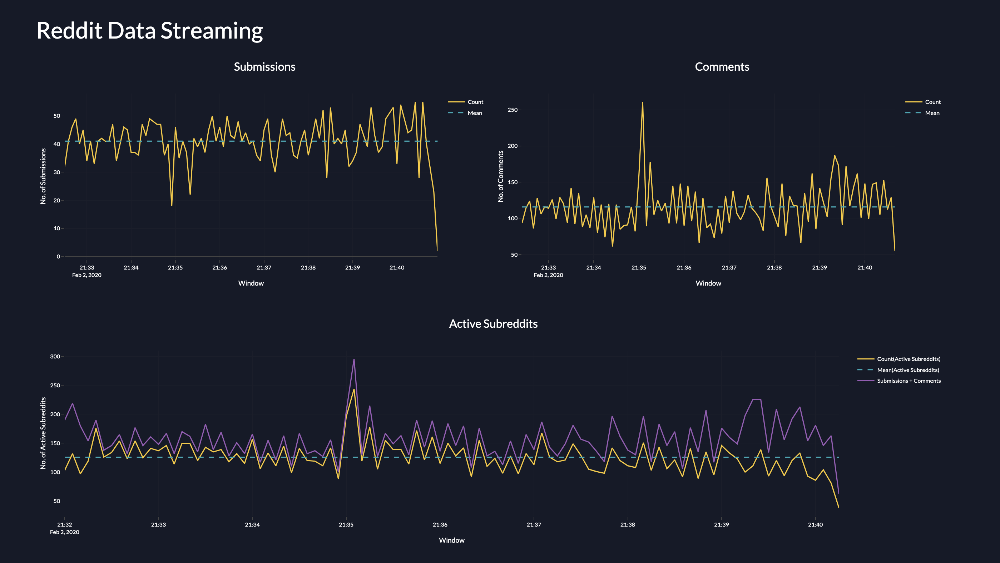

# Lambda Architecture

Lambda Architecture implementation using Kafka for stream ingestion, Spark for batch and stream processing, HDFS and Cassandra for storage and querying, Dash for live visualization, and Docker for deployment.

## Setup

```
docker-compose up -d --scale spark-worker=3
```

## UI

* Dash - localhost:8050
* Spark Master - localhost:8080
* HDFS - localhost:9870

## Screenshot


